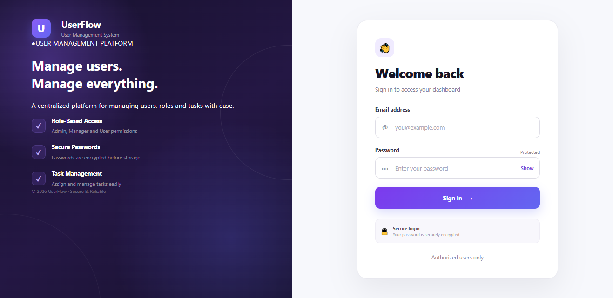
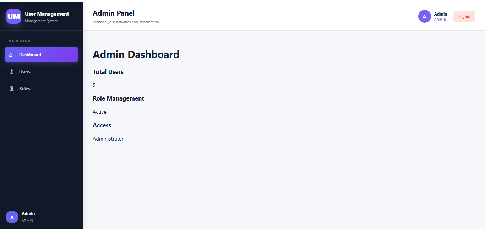
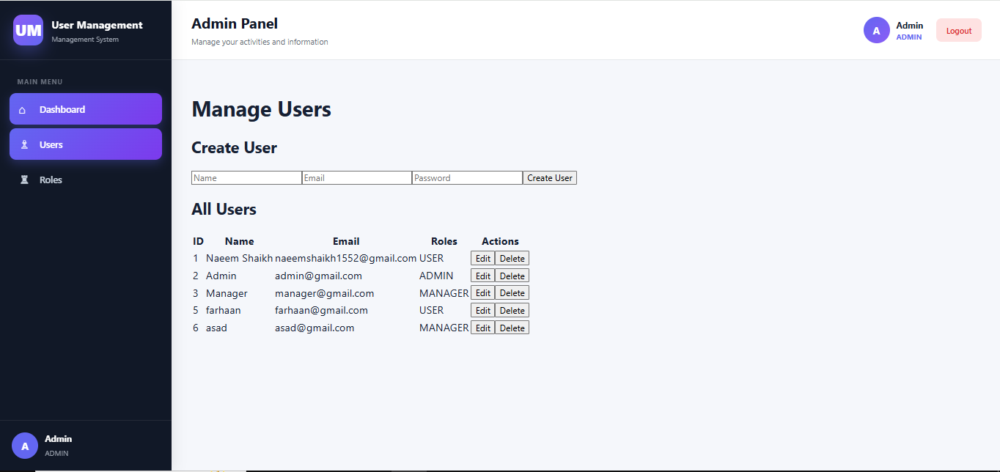
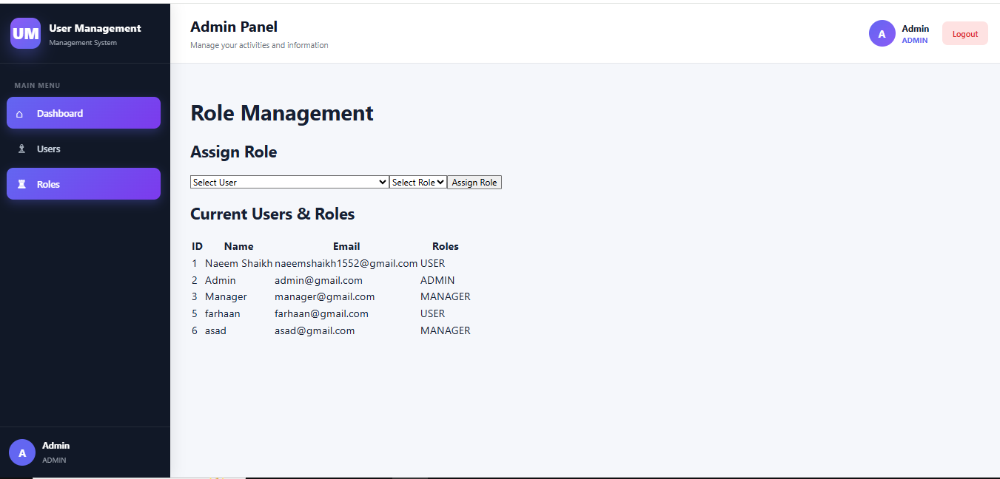
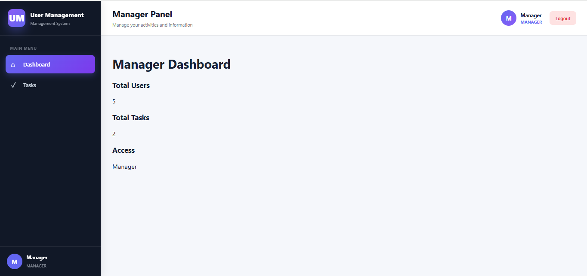
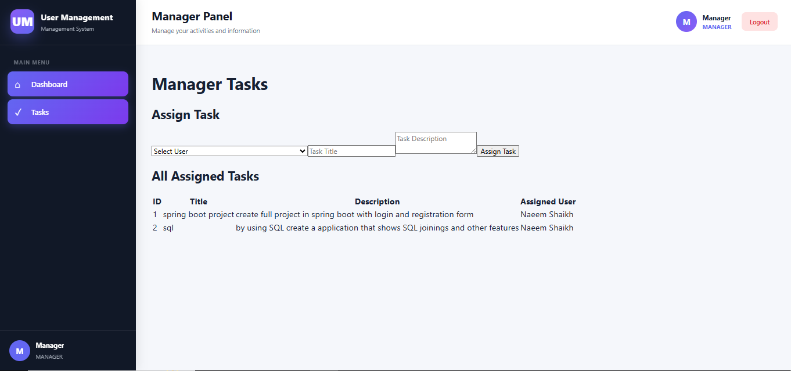
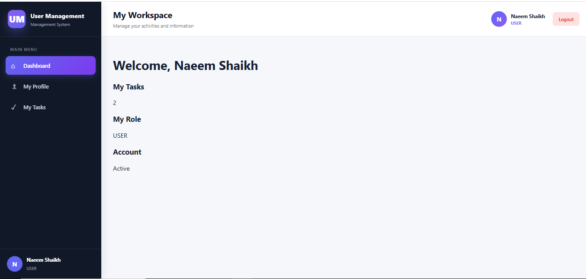
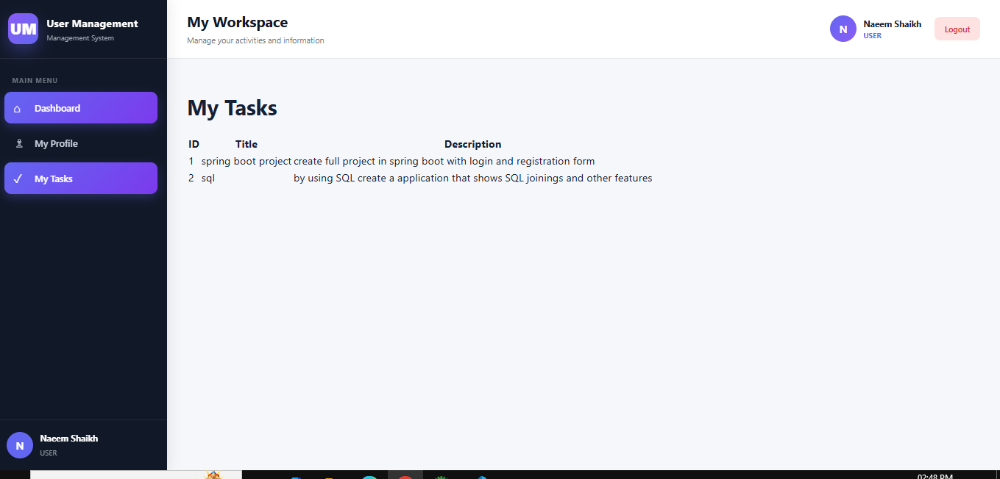
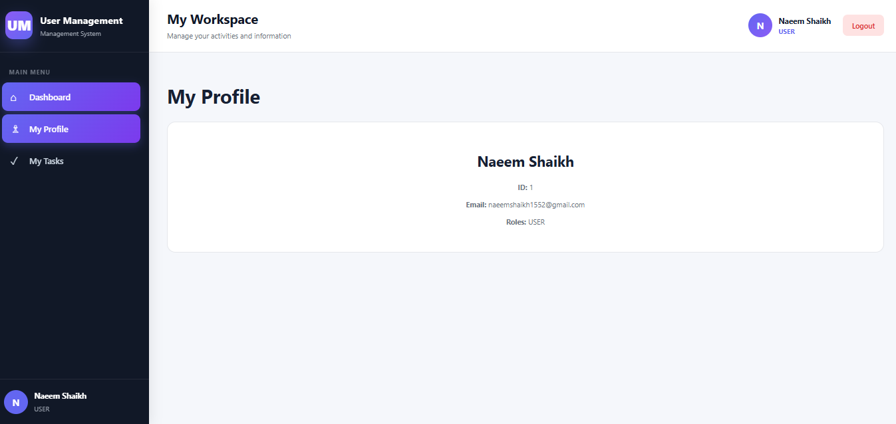

# User Management System

A full-stack **User Management System** built using **Spring Boot, Spring Security, JWT Authentication, React, Vite, JPA, and MySQL**.

The application provides secure authentication and role-based access control for **Admin, Manager, and User** roles. Each role has its own dashboard and permissions.

---

## 🚀 Features

### 🔐 Authentication & Security

* User login
* JWT-based authentication
* Spring Security integration
* Password encryption using BCrypt
* Protected REST APIs
* Role-based authorization

### 👨‍💼 Admin

* Admin dashboard
* View all users
* Manage users
* View and manage roles
* Role-based access control

### 👨‍💻 Manager

* Manager dashboard
* View assigned tasks
* Manage tasks
* Assign tasks to users
* Track task status

### 👤 User

* User dashboard
* View profile
* View assigned tasks
* Update task status
* Manage personal information

---

## 🛠️ Technologies Used

### Backend

* Java
* Spring Boot
* Spring Security
* JWT
* Spring Data JPA
* Hibernate
* REST APIs
* Maven
* MySQL

### Frontend

* React
* Vite
* JavaScript
* HTML
* CSS
* React Router

### Development Tools

* Spring Tool Suite / Eclipse
* Visual Studio Code
* Git
* GitHub
* MySQL Workbench
* Postman

---

## 🏗️ Project Structure

```text
Product-Management/
│
├── demo/
│   ├── src/
│   │   └── main/
│   │       ├── java/com/example/demo/
│   │       │   ├── config/
│   │       │   ├── controller/
│   │       │   ├── entity/
│   │       │   ├── repository/
│   │       │   └── service/
│   │       └── resources/
│   │
│   └── pom.xml
│
├── user-management/
│   ├── src/
│   │   ├── components/
│   │   │   ├── auth/
│   │   │   └── pages/
│   │   │       ├── admin/
│   │   │       ├── manager/
│   │   │       └── user/
│   │   ├── App.jsx
│   │   └── main.jsx
│   │
│   └── package.json
│
└── screenshots/
```

---

## 🔑 Role-Based Access

| Role    | Access                                            |
| ------- | ------------------------------------------------- |
| ADMIN   | User management, role management, admin dashboard |
| MANAGER | Manager dashboard, task management                |
| USER    | Profile, assigned tasks, user dashboard           |

---

## 🔄 Application Flow

```text
                    ┌──────────────┐
                    │    React     │
                    │   Frontend   │
                    └──────┬───────┘
                           │
                           │ REST API
                           ▼
                    ┌──────────────┐
                    │ Spring Boot  │
                    │   Backend    │
                    └──────┬───────┘
                           │
                  ┌────────┴────────┐
                  │                 │
                  ▼                 ▼
          ┌──────────────┐   ┌──────────────┐
          │    Spring    │   │     JWT      │
          │   Security   │   │Authentication│
          └──────────────┘   └──────────────┘
                           │
                           ▼
                    ┌──────────────┐
                    │    MySQL     │
                    │   Database   │
                    └──────────────┘
```

---

# 📸 Screenshots

## Login



## Admin Dashboard



## User Management



## Role Management



## Manager Dashboard



## Manager Tasks



## User Dashboard



## My Tasks



## My Profile



---

# ⚙️ Installation & Setup

## 1. Clone the Repository

```bash
git clone https://github.com/YOUR-USERNAME/Product-Management.git
```

```bash
cd Product-Management
```

---

## 2. Backend Setup

Navigate to the Spring Boot project:

```bash
cd demo
```

Configure your MySQL database in:

```text
src/main/resources/application.properties
```

Example:

```properties
spring.datasource.url=jdbc:mysql://localhost:3306/user_management
spring.datasource.username=root
spring.datasource.password=YOUR_PASSWORD

spring.jpa.hibernate.ddl-auto=update
spring.jpa.show-sql=true
```

Then run the Spring Boot application:

```bash
mvnw spring-boot:run
```

Or run `DemoApplication.java` from Spring Tool Suite / Eclipse.

Backend will normally run on:

```text
http://localhost:8080
```

---

## 3. Frontend Setup

Open a new terminal and navigate to:

```bash
cd user-management
```

Install dependencies:

```bash
npm install
```

Start the React application:

```bash
npm run dev
```

The frontend will normally run on:

```text
http://localhost:5173
```

---

# 🔒 Security

The application uses **JWT-based authentication**.

After successful login:

```text
User Login
     ↓
Backend validates credentials
     ↓
JWT Token generated
     ↓
Frontend stores token
     ↓
Token sent with protected API requests
     ↓
JwtAuthenticationFilter validates token
     ↓
Spring Security checks user role
     ↓
Authorized resource accessed
```

---

# 📌 API Modules

The backend contains controllers for:

* Authentication / User operations
* Admin operations
* Manager operations
* Task management

The project follows a layered architecture:

```text
Controller
     ↓
Service
     ↓
Repository
     ↓
Database
```

---

# 🧪 Testing

The REST APIs can be tested using tools such as:

* Postman
* Browser
* React frontend

Authentication-protected endpoints require a valid JWT token.

---

# 🎯 Learning Outcomes

This project demonstrates practical experience with:

* Spring Boot REST API development
* Spring Security
* JWT authentication
* Role-Based Access Control (RBAC)
* Entity relationships
* JPA/Hibernate
* MySQL database integration
* React frontend development
* API integration
* Authentication and authorization
* Git and GitHub
* Full-stack application development

---

# 👨‍💻 Author

**Naeem Shaikh**

Java Developer | Java Full Stack Developer

📍 Mumbai, India

---

## ⭐ If you find this project useful

Feel free to star ⭐ the repository.
